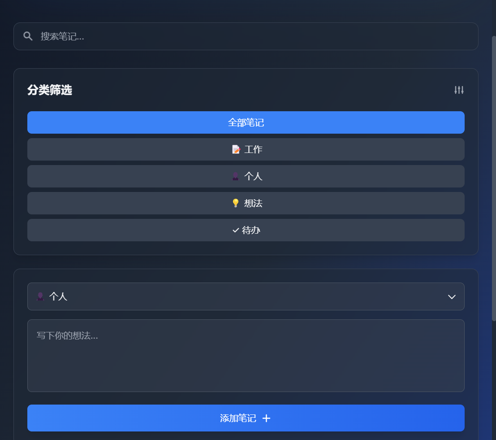

# 智能记事本 (Smart Notes)

一个基于 Electron + React + TypeScript 开发的现代化桌面记事本应用，具有优雅的用户界面和流畅的交互体验。



## ✨ 特性

- 🎨 现代化深色主题界面
- 📝 支持多种笔记分类（工作、个人、想法、待办）
- 🔍 实时搜索功能
- 💾 本地数据持久化
- 🌈 流畅的动画效果
- 📱 响应式设计

## 🚀 快速开始

### 环境要求

- Node.js 16+
- pnpm 8+

### 安装

```bash
# 克隆项目
git clone https://github.com/EmiyaK532/electron-and.git

# 进入项目目录
cd electron-and

# 安装依赖
pnpm install
```

### 开发

```bash
# 启动开发服务器
pnpm dev
```

### 构建

```bash
# Windows
pnpm build:win

# macOS
pnpm build:mac

# Linux
pnpm build:linux
```

## 🛠️ 技术栈

- Electron
- React
- TypeScript
- TailwindCSS
- Framer Motion
- React Spring
- Headless UI

## 📦 项目结构

```
src/
├── main/              # Electron 主进程
├── preload/           # 预加载脚本
└── renderer/          # React 渲染进程
    ├── src/
    │   ├── components/    # React 组件
    │   ├── assets/       # 静态资源
    │   └── App.tsx       # 应用入口
    └── index.html        # HTML 模板
```

## 🔧 配置说明

- `electron.vite.config.ts` - Electron Vite 配置
- `tailwind.config.js` - Tailwind CSS 配置
- `electron-builder.yml` - Electron Builder 配置

## 📝 使用说明

1. 选择笔记分类（工作、个人、想法、待办）
2. 在文本框中输入笔记内容
3. 点击"添加笔记"按钮保存
4. 使用搜索框查找特定笔记
5. 点击分类标签筛选不同类型的笔记
6. 悬停在笔记上可以看到删除按钮

## 🤝 贡献

欢迎提交 Issue 和 Pull Request！

## 📄 许可

[MIT License](LICENSE)
